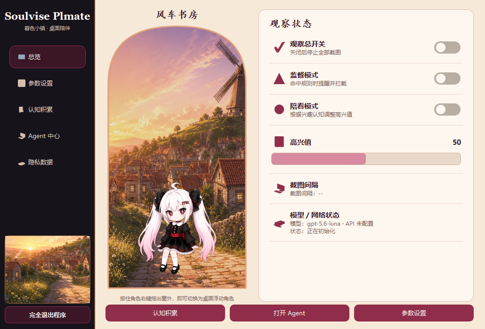

# Soulvise Plmate

> **Soulvise Plmate 是一个“Agent 的个性化 Agent”。**
>
> 它可以连接 Codex、Claude、Gemini 及其他 ACP 兼容 Agent，把这些专业 Agent 的聊天、视觉、知识和项目能力，组合成一个带有桌面角色、个性认知、监督提醒、陪看反馈和情绪互动的个人 Agent。
>
> Soulvise Plmate 并不试图重新制造所有 AI 能力，而是提供一个易于修改和扩展的桌面中枢：你可以随时更换主 Agent、为不同功能指定不同 Provider，也可以编写新的连接器，让角色形成属于自己的兴趣、表达方式和工作习惯。

[](https://github.com/iYwVuthoc/soulvise-plmate/actions/workflows/ci.yml)
[](LICENSE)
[](https://www.python.org/)



## 官方版本支持范围

| 操作系统 | v0.2.0 支持状态 | 当前范围 |
|---|---|---|
| Windows 10/11 64 位 | **正式支持** | 提供安装器和便携版；桌面角色、窗口吸附、截图观察、本机 Agent、系统托盘及全部核心功能已完成本机验收。 |
| macOS | **暂未正式支持** | 源码保留跨平台界面与安全降级设计，但尚未提供安装包；录屏权限和外部窗口后端仍待实现。 |
| Linux | **暂未正式支持** | 源码保留跨平台界面与安全降级设计，但尚未提供安装包；X11窗口后端及Wayland Portal/PipeWire截图流程仍待实现。 |

因此，当前 GitHub Release 的官方可交付版本面向 **Windows 10/11 64 位**。macOS 与 Linux 属于后续开发目标，不应把“核心界面可能启动”理解为完整兼容。

## v0.2.0 官方原始功能

以下能力由 Soulvise Plmate 官方仓库直接提供并纳入当前版本测试，不依赖第三方 Fork 或未知插件：

- 暮色小镇总控制窗口、启动页、系统托盘，以及普通、高兴、生气、眼罩、摸头、离线六种角色状态。
- Windows桌面角色浮动、拖动、普通窗口顶边吸附与跟随、全屏冻结、双击归位和完全退出。
- 统一观察引擎：监督与陪看共享截图和分析，支持动态截图间隔、画面去重、稳定等待及只保留最新画面。
- 智能监督：基础监督词条、用户自定义规则、合理语境例外、语义风险判断、拦截冷却、角色生气反馈和安全视频跳转。
- 个性陪看：按兴趣与不感兴趣词条进行同主题语义判断，改变高兴值并生成应景气泡。
- 庆祝时刻：高兴值达到100时保存永久置顶奖杯记录，显示庆祝反馈，并恢复用户设置的启动初始值。
- 认知积累：监督认知与陪看认知严格隔离，支持简化词条编辑、历史记录、误判反馈及需确认的AI整理草稿。
- 本机 Agent 中心：Codex专用深度连接，以及Claude、Gemini和自定义可信程序的ACP连接。
- 能力路由：可以更换主 Agent，并分别指定聊天、视觉、监督、认知整理、气泡润色、联网研究和项目辅助Provider。
- 通用启动入口：安全打开用户配置的Agent网页、桌面程序或Windows应用标识。
- 隐私与安全：观察默认关闭、API密钥进入系统密钥库、临时截图及时删除、迟到结果失效、只读观察会话及逐次开发审批。
- 参数与数据管理：调整观察、高兴值、模型、审核类别和拦截地址，并支持认知导出、历史清理与用户数据保留。

“ACP兼容”代表本项目提供标准协议连接能力，不代表所有Agent无需配置即可获得全部功能。只有Agent真实声明并通过聊天、图片或结构化结果自检的能力，才会进入Soulvise能力路由。

## 核心能力

- 桌面角色：透明置顶、拖动、窗口吸附、摸头、眼罩、状态动画与应景气泡。
- 统一观察：监督与陪看共享一次截图和一次分析，画面不变时不会重复请求。
- 智能监督：本地明确规则先判断，主 Agent 可补充语义风险识别；不确定或离线时不误拦。
- 个性陪看：将关键词视为兴趣主题种子，理解近义内容、上下位概念和同主题内容。
- 认知积累：监督认知与陪看认知严格隔离，AI 草稿必须经用户确认才能生效。
- 情绪反馈：高兴值变化会触发角色状态与短气泡；达到 100 分时保存永久置顶奖杯记录，然后恢复用户设置的初始值。
- 多 Agent 路由：Codex 原生深度连接，以及 Claude、Gemini、自定义程序的 ACP 连接；聊天、视觉、监督、认知整理、气泡和项目辅助可分别指定 Provider。
- 安全跳转：拦截地址支持安全热更新、校验和试开，不把地址写入日志或观察历史。

## 它不只是桌宠或聊天壳

普通桌宠主要负责展示与互动，普通聊天壳通常只转发消息。Soulvise Plmate 在两者之间增加了一层可控的“个性与能力路由”：角色认知决定它关注什么，观察策略决定何时反馈，Provider 路由决定由哪个可信 Agent 承接能力。

本项目不会把“能启动某个程序”包装成“深度连接”。启动型入口只负责打开网页或程序；只有完成协议握手、能力声明和安全自检的 Provider，才会得到聊天、图片或项目辅助能力。

## 快速安装与运行

### 使用 Release

1. 在 GitHub [Releases](https://github.com/iYwVuthoc/soulvise-plmate/releases) 下载最新 Windows 安装器或便携版。
2. 对照同一 Release 中的 `SHA256SUMS.txt` 核对文件哈希。
3. 安装器默认创建桌面与开始菜单快捷方式，不添加开机自启动。

当前个人开源版本暂未签名，Windows 可能显示“未知发布者”。哈希不一致时请勿运行。

### 从源码运行

需要 64 位 Python 3.12：

```powershell
git clone https://github.com/iYwVuthoc/soulvise-plmate.git
cd soulvise-plmate
powershell -ExecutionPolicy Bypass -File .\scripts\setup.ps1
powershell -ExecutionPolicy Bypass -File .\scripts\run.ps1
```

依赖安装在项目内的 `.venv`，不会写入系统 Python。程序数据默认位于 `%APPDATA%\Soulvise\SoulvisePlmate`。

## 连接 Codex 与 ACP Agent

### Codex

在“Agent 中心 → Codex”点击“检测并连接”。Soulvise 使用固定版本 `openai-codex` 自带的匹配运行时，通过本机 App Server 通信：

- 登录令牌由 Codex 自己管理，不进入 Soulvise 配置、数据库、日志或 Git。
- 普通聊天保持只读；开发会话的写文件、命令或提权操作必须逐次批准。
- 观察会话与聊天、开发会话隔离，拒绝工具、命令、文件修改和联网。
- 图片授权关闭时，Soulvise 绝不会把临时截图交给 Codex。

### Claude、Gemini 与自定义 ACP

在“Agent 中心 → ACP Agent”选择预设或指定可信程序：

1. 先在厂商自己的工具中安装、登录并确认可用。
2. 保存 Agent 配置，点击“连接并自检”。
3. 如需视觉能力，单独勾选图片授权；只有图片握手和结构化结果自检都通过后才会发送图片。
4. 不支持图片的 Agent 仍可用于聊天，视觉能力可以覆盖给另一个已验证 Provider。

ACP 提供通信协议兼容，并不等同于操作系统级安全沙箱。只应连接可信 Agent，不要把未知可执行文件配置为自定义 ACP。

## 切换主 Agent 与单项能力

“能力路由”中的主 Agent 默认承接其已经声明的全部能力。高级用户可以分别覆盖：

- 聊天
- 视觉分析
- 语义监督
- 认知整理
- 气泡润色
- 联网研究
- 项目辅助

Provider 不可用或没有声明某项能力时，路由不会偷偷切换到未经授权的云端服务。本地明确关键词仍可工作；不确定内容不会强制拦截。

## 编写角色认知

打开“认知积累”，按行填写关键词或短句即可，也支持中文逗号、英文逗号和分号：

```text
Python 桌面开发
风车小镇、哥特服饰
古典音乐；像素游戏
```

- 监督认知用于风险规则、例外和个人边界。
- 陪看认知分为“感兴趣”和“不感兴趣”，词条会作为同主题语义种子。
- 高级设置可补充说明、例子、例外和优先级。
- “让 AI 帮我整理”只生成预览草稿，用户确认后才写入。
- 政治规则由用户自行定义；项目不附带通用政治黑名单。

## 隐私与安全

- 首次启动时观察开关关闭，不支持隐藏监控或远程监控。
- 默认截图只在内存中流转；获授权的视觉 Provider 如需文件路径，只会在应用专用目录创建单次临时图片，并在完成、失败、取消、暂停或退出后删除。
- API 密钥使用系统密钥库；Agent 令牌由厂商运行时管理。
- 截图、窗口标题和认知上下文全部视为不可信输入，不能成为命令、工具参数或权限批准依据。
- 子进程使用程序路径与参数数组启动，不使用 Shell 字符串拼接。
- 原始截图、完整窗口标题、密钥和认证令牌不会进入日志、数据库或数据导出。

完整威胁模型、限制与漏洞报告方式见 [SECURITY.md](SECURITY.md)。

## 开发与测试

```powershell
powershell -ExecutionPolicy Bypass -File .\scripts\setup.ps1
powershell -ExecutionPolicy Bypass -File .\scripts\test.ps1
```

也可分别执行：

```powershell
.\.venv\Scripts\python.exe -m ruff check src tests scripts
.\.venv\Scripts\python.exe -m pytest
.\.venv\Scripts\python.exe -m compileall -q src tests scripts
```

测试使用合成画面与模拟 Agent，不要求打开真实不良内容，也不应调用真实云端服务。架构说明见 [docs/ARCHITECTURE.md](docs/ARCHITECTURE.md)。

## 扩展新的 Agent Provider

推荐先做启动型连接器，再为具有稳定官方协议的厂商实现深度 Provider。深度连接必须：

1. 声明真实能力，不把未验证能力展示给用户。
2. 隔离观察、聊天和开发会话。
3. 正确处理取消、超时、迟到结果和离线降级。
4. 对图片授权、结构化结果和权限边界做自检。
5. 添加模拟后端测试并通过全量回归。

完整接口和最小 ACP 示例见 [Agent 连接器规范](docs/AGENT_CONNECTOR_SPEC.md)。

## 参与贡献

欢迎 Fork 项目、提交新的 Agent 连接器、角色与认知体验改进，或实现 macOS/Linux 平台后端。提交前请阅读 [CONTRIBUTING.md](CONTRIBUTING.md) 与 [THIRD_PARTY_NOTICES.md](THIRD_PARTY_NOTICES.md)。

独立分发的修改版应清楚注明“非 Soulvise 官方发行版”，避免用户把第三方代码、模型调用或数据处理方式误认为本项目默认行为。

## 许可证

项目自有源码与仓库内现有美术素材以 [MIT License](LICENSE) 开源。第三方依赖和工具继续遵守各自许可证，详见 [THIRD_PARTY_NOTICES.md](THIRD_PARTY_NOTICES.md)。
