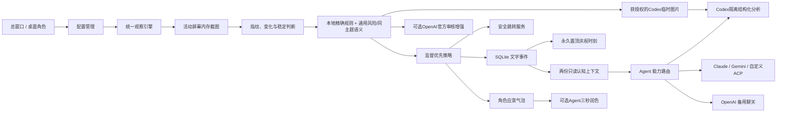

# 架构说明

## 运行数据流

## 关键不变量

1. 监督和陪看同时开启时只共享一帧截图和一次分析结果。
2. 默认原始截图只存在于 `CapturedFrame.jpeg_bytes`；遮罩后以最长边1600像素、JPEG质量72生成分析副本。视频稳定期最多保留一帧内存参考图且不超过15秒，与当前帧组成上下或左右时序图后立即释放；Codex视觉获授权时可在专用本地目录短暂物化，工作结束、替换、暂停或异常时同时清空内存和临时文件。
3. 工作线程最多一个；繁忙时新帧覆盖旧待分析帧，不建立请求积压。
4. 暂停或戴眼罩递增观察代次；旧代次结果不能进入策略层。
5. 监督先于陪看。同一画面发生冲突时不改变高兴值。
6. `supervision_context.md` 与 `companion_context.md` 分开生成，外部 Agent 只有只读语义。
7. 窗口标题只在分析时短暂使用，事件表只保存 SHA-256 摘要。
8. 气泡润色只接收事件类型、角色状态、高兴值和增减量，不接收截图、窗口标题或敏感摘要。
9. 高兴值只在从100以下首次达到100时生成一条置顶庆祝事件；事件保存峰值100，当前值随后恢复用户设置的初始值。监督命中时不计分、不庆祝。

## 平台抽象

- `CaptureBackend`：当前提供真实活动屏幕和测试合成画面实现。
- `WindowBackend`：Windows 使用 Win32；其他平台当前返回安全降级后端。
- `ContentAnalyzer`：本地精确规则、主Agent通用风险、逐规则语义置信度和可选官方审核增强共用统一结果；陪看先比较优先级再比较置信度，近似冲突保持中立。
- `AgentConnector`：网页、进程启动入口继续保留。
- `AgentProvider`：深度连接器统一声明能力、连接状态和取消语义。
- `CapabilityRouter`：主Agent默认承接全部已声明能力，并支持单项能力覆盖；不可用时不调用未授权提供者。
- `AcpAgentProvider`：通过官方ACP Python SDK连接Claude、Gemini或用户明确选择的可信ACP程序；只有握手、授权与结构化自检通过的能力才进入路由。
- `ProviderRegistry`：支持固定代码实现的Provider动态注册、注销和重载，不从用户数据目录导入未知Python插件。
- `CodexAgentService`：通过固定版本SDK连接本机App Server，隔离管理认证、聊天、开发及无工具的结构化运行会话。
- Codex观察后端超时或离线后会关闭失效App Server、替换被阻塞的单线程执行器，并在下一轮能力路由时自动预热恢复；该过程不重连或替换普通聊天会话，也不会切换到未经授权的提供者。
- `VisionTemporaryImageStore`：只管理专用目录内符合随机命名规则的JPEG，负责独占创建、异常回收、暂停清理和取得单实例锁后的崩溃遗留清理。
- `SpeechBubbleService`：立即显示本地模板，以优先级和冷却抑制刷屏；Agent润色超过3秒或迟到时自动废弃。
- `CharacterSpeechBubble`：跟随嵌入或浮动角色并在屏幕边缘翻转，同时注册截图隐私遮罩。

## 后续里程碑

1. 增加 macOS ScreenCaptureKit 权限流程与窗口后端。
2. Linux 先实现 X11，随后实现 Wayland Portal/PipeWire 选择屏幕流程。
3. 正式签名发布前补充代码签名、自动升级通道和干净虚拟机验收，并随依赖变化维护许可清单。
